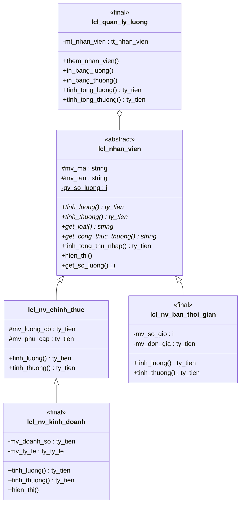

# ZOOP_QUAN_LY_LUONG – Quản lý lương & thưởng nhân viên bằng ABAP OOP


Chương trình ABAP minh họa **lập trình hướng đối tượng (OOP)** qua bài toán tính lương và thưởng cho nhiều loại nhân viên. Dự án phù hợp cho người mới học ABAP Objects muốn hiểu rõ ba tính chất cốt lõi: **tính trừu tượng**, **tính kế thừa** và **tính đa hình**.

---

## Mục lục

- [Giới thiệu](#giới-thiệu)
- [Các tính chất OOP được áp dụng](#các-tính-chất-oop-được-áp-dụng)
- [Sơ đồ lớp](#sơ-đồ-lớp)
- [Công thức tính lương & thưởng](#công-thức-tính-lương--thưởng)
- [Yêu cầu hệ thống](#yêu-cầu-hệ-thống)
- [Cài đặt & chạy chương trình](#cài-đặt--chạy-chương-trình)
- [Kết quả mẫu](#kết-quả-mẫu)
- [Mở rộng chương trình](#mở-rộng-chương-trình)
- [Giấy phép](#giấy-phép)

---

## Giới thiệu

Một công ty có ba loại nhân viên, mỗi loại có cách tính **lương** và **thưởng** khác nhau:

- **Nhân viên chính thức** – nhận lương cơ bản cộng phụ cấp.
- **Nhân viên bán thời gian** – nhận lương theo số giờ làm việc.
- **Nhân viên kinh doanh** – là nhân viên chính thức, được hưởng thêm hoa hồng theo doanh số.

Lớp quản lý lương chỉ làm việc với kiểu **nhân viên chung (lớp cha trừu tượng)**. Nó không cần biết từng nhân viên cụ thể thuộc loại nào mà vẫn tính đúng lương và thưởng cho tất cả. Đây chính là sức mạnh của đa hình.

---

## Các tính chất OOP được áp dụng

### 1. Tính trừu tượng (Abstraction)

Lớp `lcl_nhan_vien` được khai báo `ABSTRACT` và chứa các phương thức trừu tượng `tinh_luong`, `tinh_thuong`, `get_loai`, `get_cong_thuc_thuong`. Lớp này chỉ định nghĩa *"nhân viên phải có những gì"*, còn *"làm như thế nào"* do lớp con quyết định. Không thể tạo đối tượng trực tiếp từ lớp trừu tượng.

```abap
CLASS lcl_nhan_vien DEFINITION ABSTRACT.
  PUBLIC SECTION.
    METHODS tinh_thuong ABSTRACT
      RETURNING VALUE(rv_thuong) TYPE ty_tien.
```

### 2. Tính kế thừa (Inheritance)

Các lớp con kế thừa thuộc tính và phương thức từ lớp cha bằng `INHERITING FROM`. Chương trình có cả **kế thừa nhiều cấp**: `lcl_nhan_vien` → `lcl_nv_chinh_thuc` → `lcl_nv_kinh_doanh`. Lớp con tái sử dụng logic của lớp cha thông qua `super->`.

```abap
METHOD tinh_thuong.
  rv_thuong = super->tinh_thuong( ).        " Dùng lại công thức lớp cha
  IF mv_doanh_so >= c_nguong_doanh_so.
    rv_thuong = rv_thuong + mv_doanh_so * c_ty_le_thuong_ds.
  ENDIF.
ENDMETHOD.
```

### 3. Tính đa hình (Polymorphism)

Mỗi lớp con ghi đè (`REDEFINITION`) các phương thức của lớp cha. Khi gọi qua tham chiếu kiểu lớp cha, hệ thống tự chọn phiên bản đúng của đối tượng thực tế lúc chạy (*dynamic binding*).

```abap
LOOP AT mt_nhan_vien INTO DATA(lo_nv).
  " Cùng một lời gọi, mỗi nhân viên chạy một công thức khác nhau
  DATA(lv_thuong) = lo_nv->tinh_thuong( ).
ENDLOOP.
```

Chương trình còn minh họa **up-cast** (gán lớp con vào tham chiếu lớp cha) và **down-cast** (`?=`) kèm xử lý ngoại lệ `cx_sy_move_cast_error`.

### Bổ sung

- **Đóng gói (Encapsulation):** dữ liệu được bảo vệ bằng `PROTECTED SECTION` / `PRIVATE SECTION`.
- **Template Method:** `tinh_tong_thu_nhap` và `hien_thi` được viết một lần ở lớp cha nhưng hoạt động đúng cho mọi lớp con.
- **Thành phần tĩnh:** `CLASS-DATA` / `CLASS-METHODS` đếm tổng số nhân viên được tạo.

---

## Sơ đồ lớp



---

## Công thức tính lương & thưởng

| Loại nhân viên | Lương | Thưởng |
|---|---|---|
| Chính thức | Lương cơ bản + Phụ cấp | 50% × Lương cơ bản |
| Bán thời gian | Số giờ × Đơn giá | 10% × Lương nếu làm ≥ 80 giờ, ngược lại 0 |
| Kinh doanh | Lương NV chính thức + Doanh số × Tỷ lệ hoa hồng | Thưởng NV chính thức + 2% Doanh số nếu doanh số ≥ 150.000.000 |

---

## Yêu cầu hệ thống

- SAP NetWeaver **ABAP 7.40** trở lên (chương trình dùng `NEW`, khai báo inline `DATA(...)`).
- Quyền tạo chương trình trong gói local (`$TMP`) hoặc gói phát triển.
- Hệ thống Unicode để hiển thị tiếng Việt có dấu.

---

## Cài đặt & chạy chương trình

### Cách 1: Dùng SAP GUI (SE38)

1. Vào transaction **SE38**.
2. Nhập tên chương trình `ZOOP_QUAN_LY_LUONG`, chọn **Create**.
3. Chọn loại **Executable program**, lưu vào gói `$TMP`.
4. Dán toàn bộ nội dung file `ZOOP_QUAN_LY_LUONG.abap` vào trình soạn thảo.
5. Kiểm tra cú pháp (**Ctrl + F2**), kích hoạt (**Ctrl + F3**) và chạy (**F8**).

### Cách 2: Dùng ABAP Development Tools (Eclipse)

1. Chuột phải vào gói → **New** → **ABAP Program**.
2. Đặt tên `ZOOP_QUAN_LY_LUONG`, dán mã nguồn.
3. Kích hoạt (**Ctrl + F3**) và chạy (**F9**).

---

## Kết quả mẫu

Dữ liệu mẫu trong chương trình:

| Mã NV | Họ tên | Loại | Lương (VND) | Thưởng (VND) | Tổng thu nhập (VND) |
|---|---|---|---:|---:|---:|
| NV001 | Nguyễn Văn An | Chính thức | 17.000.000 | 7.500.000 | 24.500.000 |
| NV002 | Trần Thị Bình | Bán thời gian (80h) | 4.000.000 | 400.000 | 4.400.000 |
| NV004 | Phạm Thu Dung | Bán thời gian (40h) | 1.800.000 | 0 | 1.800.000 |
| NV003 | Lê Hoàng Cường | Kinh doanh | 23.000.000 | 10.000.000 | 33.000.000 |
| | | **Tổng** | **45.800.000** | **17.900.000** | **63.700.000** |

Minh họa phần bảng thưởng in ra màn hình:

```
============ BẢNG THƯỞNG (ĐA HÌNH) ============
Mã NV   Loại NV         Thưởng (VND)          Công thức thưởng
--------------------------------------------------------------------------------
NV001   Chính thức              7.500.000,00  50% x Lương cơ bản
NV002   Bán thời gian             400.000,00  10% x Lương nếu >= 80 giờ, ngược lại 0
NV004   Bán thời gian                   0,00  10% x Lương nếu >= 80 giờ, ngược lại 0
NV003   Kinh doanh             10.000.000,00  50% x Lương cơ bản + 2% Doanh số (nếu DS >= 150tr)
--------------------------------------------------------------------------------
```

> Định dạng số (dấu chấm/phẩy) phụ thuộc vào thiết lập người dùng trong transaction **SU3**.

---

## Mở rộng chương trình

Nhờ thiết kế hướng đối tượng, việc thêm một loại nhân viên mới rất đơn giản và **không cần sửa lớp quản lý lương**:

1. Tạo lớp mới kế thừa `lcl_nhan_vien` (ví dụ `lcl_nv_thuc_tap`).
2. Cài đặt lại (`REDEFINITION`) các phương thức `tinh_luong`, `tinh_thuong`, `get_loai`, `get_cong_thuc_thuong`.
3. Tạo đối tượng và gọi `them_nhan_vien( )`.

Điều này thể hiện nguyên tắc **Open/Closed** trong thiết kế phần mềm: *mở để mở rộng, đóng để sửa đổi*.

Một số ý tưởng phát triển thêm:

- Chuyển các lớp local thành lớp global (SE24) và dùng interface `lif_thuong`.
- Đọc dữ liệu nhân viên từ bảng database thay vì dữ liệu cứng.
- Hiển thị kết quả bằng ALV (`cl_salv_table`).
- Viết unit test với **ABAP Unit** (`FOR TESTING`).

---
